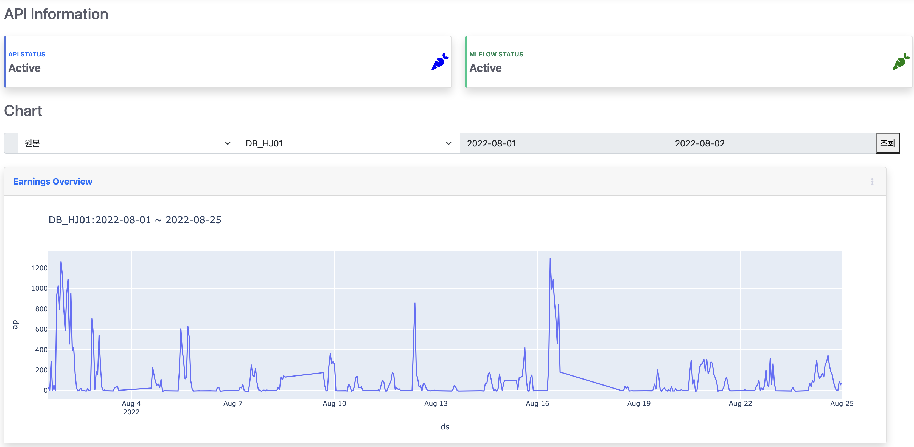
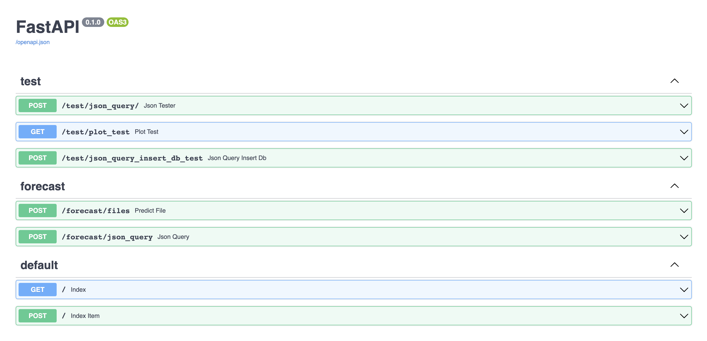
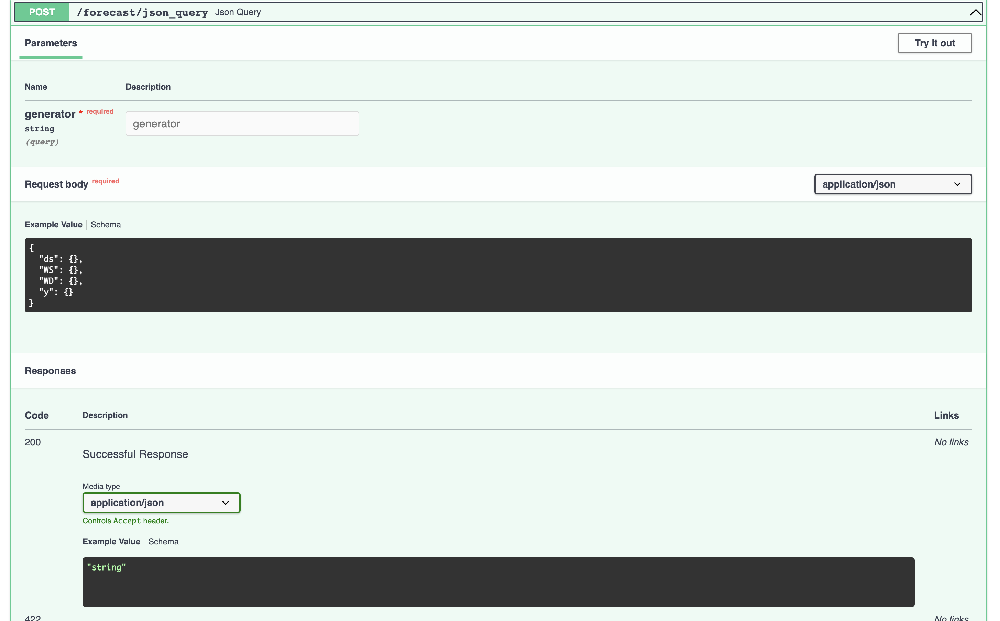

# **FastAPI** with **MLflow** Server
**샘플데이터는 제공하지 않습니다.**
## 1. 시스템 요구사항
###  python: 3.7 or upper
- pandas: 1.4.3
- numpy: 1.19.5
- neuralprophet: 0.3.2
- SQLAlchemy 1.4.42
- mlflow 1.30.0
- pysftp
- psycopg2
- plotly
- fastapi

### Database
- postgresql

## 2. 작동 샘플 이미지
### 메인 페이지 
api서버 접속 불가 시 당근이 붉게 변합니다.

### SwaggerUI

### API Sample

### URL
Main: http://127.0.0.1:8000

Docs: http://127.0.0.1:8000/docs

redoc: http://127.0.0.1:8000/redoc

